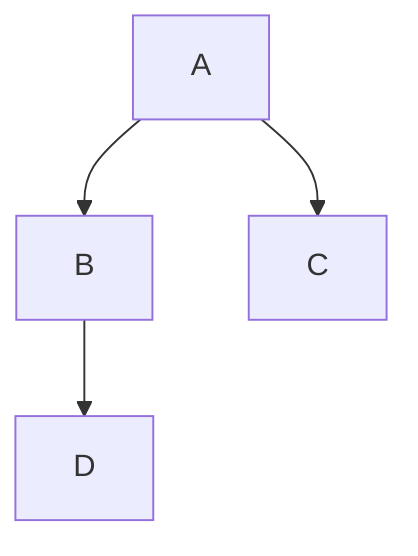
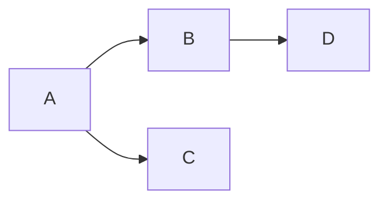
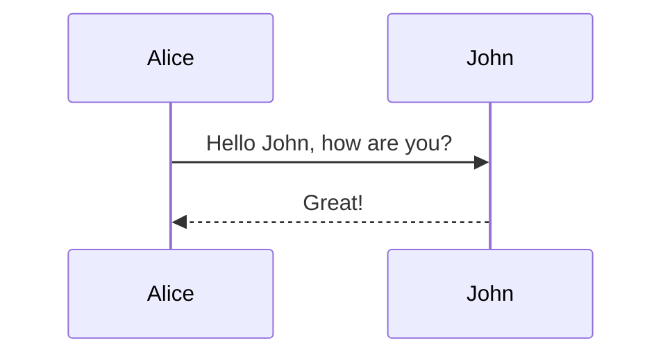
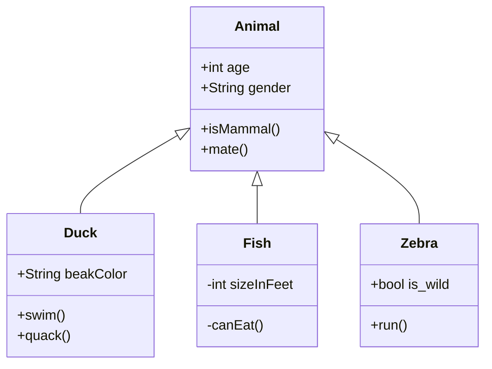
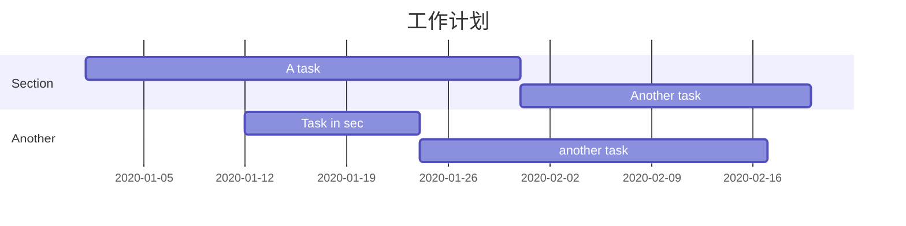
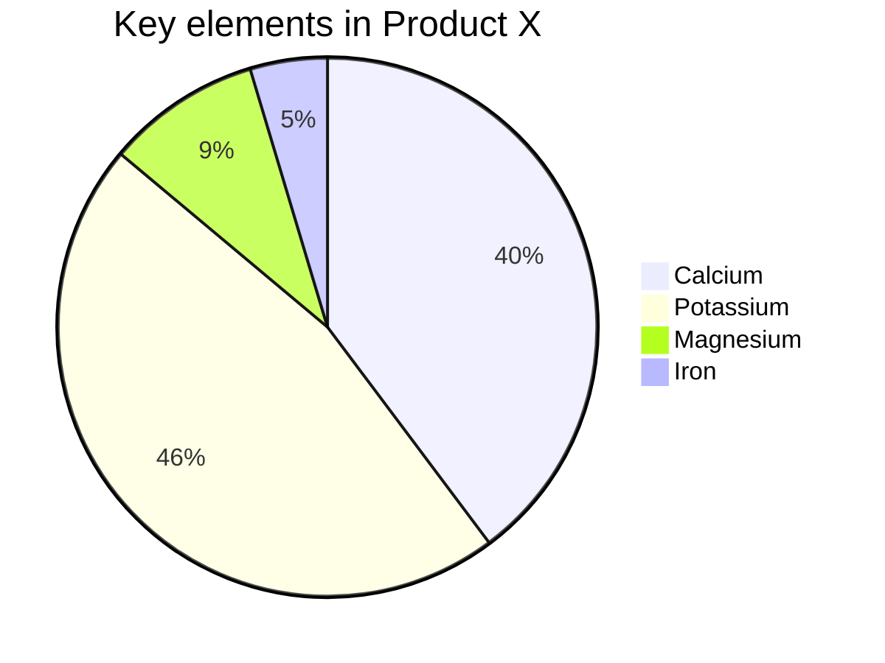

# 基础语法

# 标题一

## 二阶标题

### 三阶标题

#### 四阶标题

##### 五阶标题

###### 六阶标题

## 编辑方式

需要对内容进行重新编辑：只需要删除内容最前面的空格

## 文本样式

**加粗**

*斜体*

~~删除线~~

<center>文本居中</center>

<p style="text-align:center">文字居中</p>

## 引用

> 引用文本

## 列表

### 无序列表

- 列表一
- 列表二
- 列表三

### 有序列表

1. 列表一
2. 列表二
3. 列表三

## 链接

[百度首页](www.baidu.com)

## 图片


#### 格式：

##### 

## 表格

| 列一 | 列二 |
| ---- | ---- |
|      |      |

如下：
| 学号   | 姓名 | 序号 |
| ------ | ---- | ---- |
| 小明明 | 男   | 5    |
| 小红   | 女   | 79   |
| 小陆   | 男   | 192  |

## 代码块

### 单行代码

`for(var i=0;i<2;i++){<p>i</p>}`

### 多行代码

```编程语言
多行代码
```

## 分割线

---

## 视频

<video src="https://vd2.bdstatic.com/mda-pf5c13ybb4tf3biq/sc/cae_h264/1686100100870635414/mda-pf5c13ybb4tf3biq.mp4?v_from_s=hkapp-haokan-hbe&auth_key=1695704607-0-0-7c7457cd863c7b045ae0b4cd6f002831&bcevod_channel=searchbox_feed&pd=1&cr=2&cd=0&pt=3&logid=0206977730&vid=1472732091831268116&klogid=0206977730&abtest=112751_4" controls=""></video>

# 高级语法

## 目录

[toc]

## 注脚

这是一个需要添加注脚的文字[^1]

[^1]:注脚内容

## LaTex

### 行内公式

$\sum_{i=1}^{n} i^2$

### 块间公式

$$
a^2 + b^2 = C^2
$$

#### 除号

$$
÷
$$


#### 加减

$$
\pm
$$

#### n次方

$$
x^n
$$

#### 求和

$$
\sum_1^n
$$

#### 积分

$$
\int_1^n
$$

#### 极限

$$
lim_{x \to \infty}
$$

#### 分数

$$
\frac{3}{8}
$$

#### 矩阵与行列式

$$
\begin{matrix}
	1 & x & x^2\\
	1 & y & y^2\\
	1 & z & z^2\\
	\end{matrix}
$$

$$
\left[
\matrix{
  1 & x & x^2\\
  1 & y & y^2\\
  1 & z & z^2
}
\right]
$$

$$
a = \left[
\matrix{
  \alpha_1 & test1\\
  \alpha_2 & test2\\
  \alpha_3 & test3 
}
\right]
$$

$$
X=\left|
	\begin{matrix}
		x_{11} & x_{12} & \cdots & x_{1d}\\
		x_{21} & x_{22} & \cdots & x_{2d}\\
		\vdots & \vdots & \ddots & \vdots \\
		x_{11} & x_{12} & \cdots & x_{1d}\\
	\end{matrix}
\right|
$$

#### 分隔符

$$
() [] { } \langle\rangle
$$

#### 箭头

##### 左箭头

$$
\leftarrow
$$

##### 左长箭头

$$
\longleftarrow
$$

##### 右箭头

$$
\rightarrow
$$

##### 右长箭头

$$
\longrightarrow
$$

##### 双向箭头

$$
\leftrightarrow
$$

##### 双向长箭头

$$
\longleftrightarrow
$$


##### 双重左箭头

$$
\Leftarrow
$$

##### 双重左长箭头

$$
\Longleftarrow
$$

##### 双重右箭头

$$
\Rightarrow
$$

##### 双重右长箭头

$$
\Longrightarrow
$$

##### 双重双向箭头

$$
\Leftrightarrow
$$

##### 双重双向长箭头

$$
\Longleftrightarrow
$$

#### 方程式

$$
E=mc^2
$$

#### 分段函数

$$
f(n)=
	\begin{cases}
		n/2, & \text{if $n$ is even}\\
		3n+1,& \text{if $n$ is odd}
	\end{cases}
$$

#### 方程组

$$
\left\{
	\begin{array}{c}
		a_1x+b_1y+c_1z=d_1\\
		a_2x+b_2y+c_2z=d_2\\
		a_3x+b_3y+c_3z=d_3
	\end{array}
\right.
$$

#### 常用公式代码汇总表

##### 上/下标

| 算式  | Markdown |
| :---: | :------: |
| $x^2$ | `$x^2$`  |
| $y_1$ | `$y_1$`  |

##### 分式

|     算式      |    Markdown     |
| :-----------: | :-------------: |
| $\frac{1}{2}$ | `$\frac{1}{2}$` |
|      1/2      |       1/2       |

##### 开根号

|    算式    |   Markdown   |
| :--------: | :----------: |
| $\sqrt{2}$ | `$\sqrt{2}$` |

##### 矢量

|   算式    |  Markdown   |
| :-------: | :---------: |
| $\vec{a}$ | `$\vec{a}$` |

##### 积分

|        算式         |       Markdown        |
| :-----------------: | :-------------------: |
|     $\int{x}dx$     |     `$\int{x}dx$`     |
| $\int_{1}^{2}{x}dx$ | `$\int_{1}^{2}{x}dx$` |

##### 极限

|             算式             |            Markdown            |
| :--------------------------: | :----------------------------: |
|           $lima+b$           |           `$lima+b$`           |
| $\lim_{n\rightarrow+\infty}$ | `$\lim_{n\rightarrow+\infty}$` |

##### 累加

|          算式           |         Markdown          |
| :---------------------: | :-----------------------: |
|        $\sum{a}$        |        `$\sum{a}$`        |
| $\sum_{n=1}^{100}{a_n}$ | `$\sum_{n=1}^{100}{a_n}$` |

##### 累乘

|          算式           |         Markdown          |
| :---------------------: | :-----------------------: |
|       $\prod{x}$        |       `$\prod{x}$`        |
| $\prod_{n=1}^{99}{x_n}$ | `$\prod_{n=1}^{99}{x_n}$` |

##### 三角函数

| 三角函数 | Markdown |
| :------: | :------: |
|  $\sin$  | `$\sin$` |
|  $\cos$  | `$\cos$` |
|  $\tan$  | `$\tan$` |
|  $\cot$  | `$\cot$` |

##### 对数函数

|   算式    |  Markdown   |
| :-------: | :---------: |
|  $\ln2$   |  `$\ln2$`   |
| $\log_28$ | `$\log_28$` |
|  $\lg10$  |  `$\lg10$`  |

##### 关系运算符

|  运算符  |  Markdown  |
| :------: | :--------: |
|  $\pm$   |  `$\pm$`   |
| $\times$ | `$\times$` |
| $\cdot$  | `$\cdot$`  |
|  $\div$  |  `$\div$`  |
|  $\neq$  |  `$\neq$`  |
| $\equiv$ | `$\equiv$` |
|  $\leq$  |  `$\leq$`  |
|  $\geq$  |  `$\geq$`  |

##### 其他特殊字符

|    运算符    | 意思 |    Markdown    |
| :----------: | :--: | :------------: |
|  $\forall$   | 任意 |  `$\forall$`   |
|   $\infty$   | 无穷 |   `$\infty$`   |
| $\emptyset$  |      | `$\emptyset$`  |
|  $\exists$   | 存在 |  `$\exists$`   |
|   $\nabla$   |      |   `$\nabla$`   |
|    $\bot$    | 垂直 |    `$\bot$`    |
|   $\angle$   | 相交 |   `$\angle$`   |
|  $\because$  | 因为 |  `$\because$`  |
| $\therefore$ | 所以 | `$\therefore$` |

#### 箭头

|       符号        |      Markdown       |         符号          |        Markdown         |
| :---------------: | :-----------------: | :-------------------: | :---------------------: |
|   $\leftarrow$    |   `$\leftarrow$`    |   $\longleftarrow$    |   `$\longleftarrow$`    |
|   $\rightarrow$   |   `$\rightarrow$`   |   $\longrightarrow$   |   `$\longrightarrow$`   |
| $\leftrightarrow$ | `$\leftrightarrow$` | $\longleftrightarrow$ | `$\longleftrightarrow$` |
|   $\Leftarrow$    |   `$\Leftarrow$`    |   $\Longleftarrow$    |   `$\Longleftarrow$`    |
|   $\Rightarrow$   |   `$\Rightarrow$`   |   $\Longrightarrow$   |   `$\Longrightarrow$`   |
| $\Leftrightarrow$ | `$\Leftrightarrow$` | $\Longleftrightarrow$ | `$\Longleftrightarrow$` |

#### 数学符号汇总

##### 上下标

^：表示上标

_：表示下标

如果上（下）标内容多于一个字符就需要使用{}，注意不是( ), 因为( )经常是公式本身组成部分， 为避免冲突，所以选用了{ } 将其包起来。 

示例：`$x^{y^z}=(1+e^x)^{-2xy^w}$ `

效果：$x^{y^z}=(1+e^x)^{-2xy^w}$

上面输入的上下标都是在字符的右侧，要想在左侧或者两侧都写上下标，那么需要使用`\sideset`语 法。 

示例：`$\sideset{^1_2}{^3_4}\bigotimes$` 

效果：$\sideset{^1_2}{^3_4}\bigotimes$

##### 括号和分隔符

( )和[ ]就是自身了，由于{ } 是Tex的元字符，所以表示它自身时需要转义。

1 2 3 4 5 6 7 8 9 10 11 12 13 14 15 16 17 

示例：`$f(x,y) = x^2 + y^2, x\epsilon[0,100]$`

 效果：$f(x,y) = x^2 + y^2, x\epsilon[0,100]$ 

有时候括号需要大号的，普通括号不好看，此时需要使用\left和\right加大括号的大小。 

示例：`$(\frac{x}{y})^8，\left(\frac{x}{y}\right)^8$`

 效果：$(\frac{x}{y})^8，\left(\frac{x}{y}\right)^8$ 

\left和\right必须成对出现，对于不显示的一边可以使用 . 代替。 

示例：`$\left.\frac{{\rm d}u}{{\rm d}x} \right| _{x=0}$`

效果：$\left.\frac{{\rm d}u}{{\rm d}x} \right| _{x=0}$

##### 分数

使用\frac{分子}{分母}格式，或者 分子\over 分母。

 示例：`$\frac{1}{2x+1}或者1\over{2x+1}$` 

效果：$\frac{1}{2x+1}或者1\over{2x+1}$

##### 开方

示例：`$\sqrt[9]{3}和\sqrt{3}$ `

效果：$\sqrt[9]{3}和\sqrt{3}$

##### 省略号

有两种省略号，\ldots 表示语文本底线对其的省略号，\cdots表示与文本中线对其的省略号。

 示例：`$f(x_1, x_2, \ldots, x_n)=x_1^2 + x_2^2+ \cdots + x_n^2$`

效果：$f(x_1, x_2, \ldots, x_n)=x_1^2 + x_2^2+ \cdots + x_n^2$

##### 矢量

示例：`$\vec{a} \cdot \vec{b}=0$` 

效果： $\vec{a} \cdot \vec{b}=0$

##### 积分

示例：`$\int_0^1x^2{\rm d}x$` 

效果：$\int_0^1x^2{\rm d}x$

##### 极限

示例：`$\lim_{n\rightarrow+\infty}\frac{1}{n(n+1)}$` 

效果：$\lim_{n\rightarrow+\infty}\frac{1}{n(n+1)}$ 

##### 累加、累乘

乘 示例：`$\sum_1^n\frac{1}{x^2}，\prod_{i=0}^n\frac{1}{x^2}$`

效果：$\sum_1^n\frac{1}{x^2}，\prod_{i=0}^n\frac{1}{x^2}$

##### 希腊字母

|     字母      |    Markdown     |    字母    |   Markdown   |
| :-----------: | :-------------: | :--------: | :----------: |
|   $\alpha$    |   `$\alpha$`    |  $\Alpha$  |  `$\Alpha$`  |
|    $\beta$    |    `$\beta$`    |  $\Beta$   |  `$\Beta$`   |
|   $\gamma$    |   `$\gamma$`    |  $\Gamma$  |  `$\Gamma$`  |
|   $\delta$    |   `$\delta$`    |  $\Delta$  |  `$\Delta$`  |
|  $\epsilon$   |  `$\epsilon$`   | $\Epsilon$ | `$\Epsilon$` |
| $\varepsilon$ | `$\varepsilon$` |            |              |
|    $\zeta$    |    `$\zeta$`    |  $\Zeta$   |  `$\Zeta$`   |
|    $\eta$     |    `$\eta$`     |   $\Eta$   |   `$\Eta$`   |
|   $\theta$    |   `$\theta$`    |  $\Theta$  |  `$\Theta$`  |
|  $\vartheta$  |  `$\vartheta$`  |            |              |
|    $\iota$    |    `$\iota$`    |  $\Iota$   |  `$\Iota$`   |
|   $\kappa$    |   `$\kappa$`    |  $\Kappa$  |  `$\Kappa$`  |
|   $\lambda$   |   `$\lambda$`   | $\Lambda$  | `$\Lambda$`  |
|     $\mu$     |     `$\mu$`     |   $\Mu$    |   `$\Mu$`    |
|     $\nu$     |     `$\nu$`     |   $\Nu$    |   `$\Nu$`    |
|     $\xi$     |     `$\xi$`     |   $\Xi$    |   `$\Xi$`    |
|      $o$      |      `$o$`      |    $O$     |      O$      |
|     $\pi$     |     `$\pi$`     |   $\Pi$    |   `$\Pi$`    |
|   $\varpi$    |   `$\varpi$`    |            |              |
|    $\rho$     |    `$\rho$`     |   $\Rho$   |   `$\Rho$`   |
|   $\varrho$   |   `$\varrho$`   |            |              |
|   $\sigma$    |   `$\sigma$`    |  $\Sigma$  |  `$\Sigma$`  |
|  $\varsigma$  |  `$\varsigma$`  |            |              |
|    $\tau$     |    `$\tau$`     |   $\Tau$   |   `$\Tau$`   |
|  $\upsilon$   |  `$\upsilon$`   | $\Upsilon$ | `$\Upsilon$` |
|    $\phi$     |    `$\phi$`     |   $\Psi$   |   `$\Psi$`   |
|   $\varphi$   |   `$\varphi$`   |            |              |
|    $\chi$     |    `$\chi$`     |   $\Chi$   |   `$\Chi$`   |
|    $\psi$     |    `$\psi$`     |   $\Psi$   |   `$\Psi$`   |
|   $\omega$    |   `$\omega$`    |  $\Omega$  |  `$\Omega$`  |

#### 数学符号大汇总

|    符号    |   Markdown   |     符号     |    Markdown    |
| :--------: | :----------: | :----------: | :------------: |
|   $\pm $   |   `$\pm$`    | $\bigotimes$ | `$\bigotimes$` |
|  $\times$  |  `$\times$`  | $\bigoplus$  | `$\bigoplus$`  |
|   $\div$   |   `$\div$`   |    $\leq$    |    `$\leq$`    |
|   $\mid$   |   `$\mid$`   |    $\geq$    |    `$\geq$`    |
|  $\cdot$   |  `$\cdot$`   |    $\neq$    |    `$\neq$`    |
|  $\circ$   |  `$\circ$`   |  $\approx$   |  `$\approx$`   |
|   $\ast$   |   `$\ast$`   |   $\equiv$   |   `$\equiv$`   |
| $\bigodot$ | `$\bigodot$` |    $\sum$    |    `$\sum$`    |
|  $\prod$   |  `$\prod$`   |  $\coprod$   |  `$\coprod$`   |

##### 集合运算符

|    符号     |   Markdown    |    符号     |   Markdown    |
| :---------: | :-----------: | :---------: | :-----------: |
| $\emptyset$ | `$\emptyset$` |  $\bigcap$  |  `$\bigcap$`  |
|    $\in$    |    `$\in$`    |  $\bigcup$  |  `$\bigcup$`  |
|  $\notin$   |  `$\notin$`   |  $\bigvee$  |  `$\bigvee$`  |
|  $\subset$  |  `$\subset$`  | $\bigwedge$ | `$\bigwedge$` |
|  $\supset$  |  `$\supset$`  | $\biguplus$ | `$\biguplus$` |
| $\subseteq$ | `$\subseteq$` | $\bigsqcup$ | `$\bigsqcup$` |
| $\supseteq$ | `$\supseteq$` |             |               |

##### 对数运算符

|  符号  | Markdown | 符号  | Markdown |
| :----: | :------: | :---: | :------: |
| $\log$ | `$\log$` | $\lg$ | `$\lg$`  |
| $\ln$  | `$\ln$`  |       |          |

##### 三角函数运算符

|    符号    |   Markdown   |   符号   |  Markdown  |
| :--------: | :----------: | :------: | :--------: |
|   $\bot$   |   `$\bot$`   | $\angle$ | `$\angle$` |
| $30^\circ$ | `$30^\circ$` |          |            |
|   $\sin$   |   `$\sin$`   |  $\cos$  |  `$\cos$`  |
|   $\tan$   |   `$\tan$`   |  $\cot$  |  `$\cot$`  |
|   $\sec$   |   `$\sec$`   |  $\csc$  |  `$\csc$`  |

##### 微积分运算符

|    符号     |   Markdown    |   符号   |  Markdown  |
| :---------: | :-----------: | :------: | :--------: |
| $y\prime x$ | `$y\prime x$` |  $\int$  |  `$\int$`  |
|   $\iint$   |   `$\iint$`   | $\iiint$ | `$\iiint$` |
|  $\iiiint$  |  `$\iiiint$`  | $\oint$  | `$\oint$`  |
|   $\lim$    |   `$\lim$`    | $\infty$ | `$\infty$` |
|  $\nabla$   |  `$\nabla$`   |          |            |

##### 逻辑运算符

|     符号      |    Markdown     |     符号     |    Markdown    |
| :-----------: | :-------------: | :----------: | :------------: |
|  $\because$   |  `$\because$`   | $\therefore$ | `$\therefore$` |
|   $\forall$   |   `$\forall$`   |  $\exists$   |  `$\exists$`   |
|    $\not=$    |    `$\not=$`    |   $\not>$    |   `$\not>$`    |
| $\not\subset$ | `$\not\subset$` |              |                |

##### 戴帽符号

|    符号     |   Markdown    |    符号     |   Markdown    |
| :---------: | :-----------: | :---------: | :-----------: |
|  $\hat{y}$  |  `$\hat{y}$`  | $\check{y}$ | `$\check{y}$` |
| $\breve{y}$ | `$\breve{y}$` |             |               |

##### 连线符号

|                   符号                   |                  Markdown                  |
| :--------------------------------------: | :----------------------------------------: |
|           $\overline{a+b+c+d}$           |           `$\overline{a+b+c+d}$`           |
|          $\underline{a+b+c+d}$           |          `$\underline{a+b+c+d}$`           |
| $\overbrace{a+\underbrace{b+c}_{1.0}+d}$ | `$\overbrace{a+\underbrace{b+c}_{1.0}+d}$` |

##### 箭头符号

|         符号          |        Markdown         |         符号          |        Markdown         |
| :-------------------: | :---------------------: | :-------------------: | :---------------------: |
|      $\uparrow$       |      `$\uparrow$`       |     $\downarrow$      |     `$\downarrow$`      |
|      $\Uparrow$       |      `$\Uparrow$`       |     $\Downarrow$      |     `$\Downarrow$`      |
|     $\rightarrow$     |     `$\rightarrow$`     |     $\leftarrow$      |     `$\leftarrow$`      |
|     $\Rightarrow$     |     `$\Rightarrow$`     |     $\Leftarrow$      |     `$\Leftarrow$`      |
|   $\longrightarrow$   |   `$\longrightarrow$`   |   $\longleftarrow$    |   `$\longleftarrow$`    |
|   $\Longrightarrow$   |   `$\Longrightarrow$`   |   $\Longleftarrow$    |   `$\Longleftarrow$`    |
|   $\leftrightarrow$   |   `$\leftrightarrow$`   |   $\Leftrightarrow$   |   `$\Leftrightarrow$`   |
| $\longleftrightarrow$ | `$\longleftrightarrow$` | $\Longleftrightarrow$ | `$\Longleftrightarrow$` |

##### 转移字符

| 符号 | Markdown | 符号 | Markdown |
| :--: | :------: | :--: | :------: |
| $\ $ |  `$\ $`  | $\#$ |  `$\#$`  |
| $\$$ |  `$\$$`  | $\%$ |  `$\%$`  |
| $\&$ |  `$\&$`  | $-$  |  `$-$`   |
| $\{$ |  `$\{$`  | $\}$ |  `$\}$`  |

##### 字体

|           符号           |    Markdown    |          符号           |    Markdown     |
| :----------------------: | :------------: | :---------------------: | :-------------: |
|   ${\rm text}$：罗马体   | `${\rm text}$` | ${\it text}$：意大利体  | `${\it text}$`  |
|    ${\bf text}$：黑体    | `${\bf text}$` |   ${\cal text}$：花体   | `${\cal text}$` |
|   ${\sf text}$：等线体   | `${\sf text}$` | ${\mit text}$：数学斜体 | `${\mit text}$` |
| ${\tt text}$：打字机字体 | `${\tt text}$` |                         |                 |

#### 常用公式

##### 线性模型

$$
h(\theta) = \sum_{j=0} ^n \theta_j x_j
$$

##### 均方误差

$$
J(\theta) = \frac{1}{2m}\sum_{i=0}^m(y^i - h_\theta(x^i))^2
$$

##### 求积公式

$$
H_c=\sum_{l_1+\dots +l_p}\prod^p_{i=1} \binom{n_i}{l_i}
$$

##### 批量梯度下降

$$
\frac{\partial J(\theta)}{\partial\theta_j} = -
\frac1m\sum_{i=0}^m(y^i - h_\theta(x^i))x^i_j
$$

###### 推导过程

$$
\begin{align}
\frac{\partial J(\theta)}{\partial\theta_j}
& = -\frac1m\sum_{i=0}^m(y^i - h_\theta(x^i)) \frac{\partial}
{\partial\theta_j}(y^i-h_\theta(x^i))\\
& = -\frac1m\sum_{i=0}^m(y^i-h_\theta(x^i)) \frac{\partial}
{\partial\theta_j}(\sum_{j=0}^n\theta_j x^i_j-y^i)\\
&=-\frac1m\sum_{i=0}^m(y^i -h_\theta(x^i)) x^i_j
\end{align}
$$

#### 杂例

$$
f(n) =
\begin{cases}
n/2, & \text{if $n$ is even} \\
3n+1, & \text{if $n$ is odd}
\end{cases}
$$

$$
\left\{
\begin{array}{c}
a_1x+b_1y+c_1z=d_1 \\
a_2x+b_2y+c_2z=d_2 \\
a_3x+b_3y+c_3z=d_3
\end{array}
\right.
$$

$$
X=\left(
\begin{matrix}
x_{11} & x_{12} & \cdots & x_{1d}\\
x_{21} & x_{22} & \cdots & x_{2d}\\
\vdots & \vdots & \ddots & \vdots\\
x_{m1} & x_{m2} & \cdots & x_{md}\\
\end{matrix}
\right)
=\left(
\begin{matrix}
x_1^T \\
x_2^T \\
\vdots\\
x_m^T \\
\end{matrix}
\right)
$$

$$
\begin{align}
\frac{\partial J(\theta)}{\partial\theta_j}
& = -\frac1m\sum_{i=0}^m(y^i-h_\theta(x^i)) \frac{\partial}{\partial\theta_j}
(y^i-h_\theta(x^i)) \\
& = -\frac1m\sum_{i=0}^m(y^i-h_\theta(x^i)) \frac{\partial}{\partial\theta_j}
(\sum_{j=0}^n\theta_jx_j^i-y^i) \\
& = -\frac1m\sum_{i=0}^m(y^i-h_\theta(x^i))x^i_j
\end{align}
$$


## emoji表情

:horse:

## 流程图

Mermaid 支持绘制非常多种类的图，常见的有时序图、流程图、类图、甘特图等等。下面分享一下如何绘制这些图，语法非常容易掌握。

先在 Typora 中，输入 **```mermaid** 然后敲击回车，即可初始化一张空白图。

语法解释：`graph` 关键字就是声明一张流程图，`TD` 表示的是方向，这里的含义是 Top-Down 由上至下。






### **时序图**

语法解释：`->>` 代表实线箭头，`-->>` 则代表虚线。



### **状态图**

语法解释：`[*]` 表示开始或者结束，如果在箭头右边则表示结束。


### **类图**

语法解释：`<|--` 表示继承，`+` 表示 `public`，`-` 表示 `private`，学过 Java 的应该都知道。



### **甘特图**

甘特图一般用来表示项目的计划排期，目前在工作中经常会用到。

语法也非常简单，从上到下依次是图片标题、日期格式、项目、项目细分的任务。



### **饼图**

饼图使用 `pie` 表示，标题下面分别是区域名称及其百分比。



